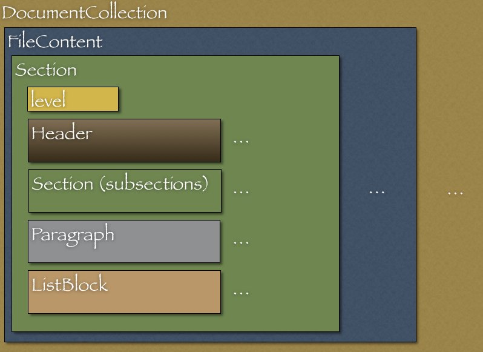

[[extending]]
== Extending RedPen

You can extend the functionality of RedPen by creating your own validators using Java and JavaScript.
This section describes how to create validators.

[[extending-with-java]]
=== Extending RedPen with Java

This section describes how to construct validators using Java and explains the basics of the
internal document model used by validators.

To create a new validator, you write a class that extends the abstract class **Validator**.

[[extending-validators]]
==== Extending Validator

The Validator class has three methods: validate, prevalidate and init.

[[validate-methods]]
==== validate method

To create a new validator, you must implement the "validate" method.
There are three types of validate method, determined by the parameter that you use with it.

[source,java]
----
/**
 * Validate the input document and return the invalid points.
 * {@link cc.redpen.validator.Validator} provides an empty implementation. The Validator implementation for validating documents can override this method.
 *
 * @param document input
 */
 public void validate(Document document)

 /**
  * Validate the input document and return the invalid points.
  * {@link cc.redpen.validator.Validator} provides an empty implementation. The Validator implementation for validating sentences can override this method.
  *
  * @param sentence input
  */
  public void validate(Sentence sentence)

 /**
  * Validate the input document and return the invalid points.
  * {@link cc.redpen.validator.Validator} provides an empty implementation. The Validator implementation for validating sections can override this method.
  *
  * @param section input
  */
  public void validate(Section section)
----

NOTE: The implemented class must be located in one of the following packages: 'cc.redpen.validator', 'cc.redpen.validator.sentence' or 'cc.redpen.validator.section.'

[[prevalidate-method]]
==== preValidate method

The preValidate method is called before the validate method is run.
This method is useful to create prerequisites to running the validate method.
There are two types of preValidate method, determined by the parameter that you use with it.

[source,java]
----
/**
 * Process input blocks before running validation. This method is used to store
 * the information needed to run Validator before the validation process.
 *
 * @param sentence input sentence
 */
 public void preValidate(Sentence sentence)

 /**
  * Process input blocks before running validation. This method is used to store
  * the information needed to run Validator before the validation process.
  *
  * @param section input section
  */
  public void preValidate(Section section)
----

[[conf-properties]]
[suppress='WeakExpression SymbolWithSpace']
==== Configuration properties

Some validators require properties to be set. You can use the *validator* constructor to define properties.
By defining properties, you ensure that RedPen understands that your validator supports those properties.

[source,java]
----
/**
 * @param keyValues String key and Object value pairs for supported configuration properties.
 */
public Validator(Object...keyValues)
----

For example, the validator *SentenceLength* has the property **max_len**,
which specifies the maximum length of sentences allowed in checked files.
The configuration below specifies that the maximum length is 200.

[source,xml]
----
<redpen-conf>
    <validators>
        ...
        <validator name="SentenceLength">
            <property name="max_len" value="200"/>
        </validator>
        ...
    </validators>
</redpen-conf>
----

*SentenceLength* loads the value of **max_len** automatically if it is defined in the validator's constructor.
If **max_len** is missing from the configuration, the default is used.

[source,java]
----

public SentenceLengthValidator() {
  super("max_len", 30); // Default maximum length of sentences.
}

----

You can reference set property values by using `getInt("property-name")`.

If you want to process configuration properties before executing the `validate()` method, you must override the `init()` method.

[[adding-validators]]
[suppress='WeakExpression']
==== Adding validators

There are two ways to add your validator to RedPen:

1. Add the validator source file to the RedPen source tree and then build RedPen in the normal way.
This method is relatively simple, but involves bundling the source code for the validator with the source code for RedPen.

2. Create a validator plugin.
Creating a plugin has the advantage that you can independently manage the source code for your validator.

Note that in both cases, your validator's class name must have the suffix **Validator**.

[[add-a-validator-in-redpen-source]]
==== Adding a validator to RedPen source

This section describes how to implement a validator called "PlainSentenceLengthValidator" and add it to the RedPen source.
"PlainSentenceLengthValidator" checks for sentences that are over 100 characters long.

[[sentencelengthvalidator]]
===== PlainSentenceLengthValidator

First, create the PlainSentenceLengthValidator class in the package **cc.redpen.validator.sentence**.
Save the class in the directory **redpen/redpen-core/src/main/java/cc/redpen/validator/sentence/**.

The code snippet below shows how to implement the class.

[source,java]
----
package cc.redpen.validator.sentence;

/**
 * Check for sentences that contain more than the specified number of characters.
 */
public class PlainSentenceLengthValidator extends Validator {

  /**
   * Default constructor initializes properties with their default values.
   */
  public PlainSentenceLengthValidator() {
    super("max_len", 100); // Default maximum length of sentences.
  }

  @Override
  public void validate(Sentence sentence) {
    if (sentence.getContent().length() > getInt("max_len")) {
      addValidationError(sentence, sentence.getContent().length(), maxLength);
    }
  }
}
----

This class has a *validate* method that takes a *Sentence* object as its parameter.
When this class is registered in the configuration file,
RedPen automatically checks each sentence in the input document according to the method.

[[include-a-new-validator]]
===== Registering a validator in the configuration file

To include a validator in a RedPen validation, add the validator's name to a configuration file.
At this time, remove the **Validator** suffix from the validator name.

For example, to include "PlainSentenceLengthValidator" in a RedPen validation,
edit the configuration file as follows:

[source,xml]
----
<redpen-conf>
    <validator>
        ...
        <validator name="PlainSentenceLength" />
        ...
    </validator>
</redpen-conf>
----

Then execute RedPen as normal, using this configuration file.

[[create-a-validator-plugin]]
[suppress='ParagraphNumber']
==== Creating a validator plugin

The usual way of creating a validator plugin is to use an existing plugin as a template.

For example, a simple validator plugin is linked to below.

https://github.com/takahi-i/hankaku-kana-validator[hankaku_kana_validator].

The most significant file in a plugin is `pom.xml`, which is located at the top of the project.
This file is the Maven configuration file.
Maven is a popular software project management tool for Java.

The content of `pom.xml` is as follows:

[source,java]
----
<project xmlns="http://maven.apache.org/POM/4.0.0" xmlns:xsi="http://www.w3.org/2001/XMLSchema-instance"
          xsi:schemaLocation="http://maven.apache.org/POM/4.0.0 http://maven.apache.org/maven-v4_0_0.xsd">
    <modelVersion>4.0.0</modelVersion>
    <groupId>redpen.cc</groupId>
    <artifactId>hankaku-kana-validator</artifactId>
    <version>1.0-SNAPSHOT</version>
    <name>hankaku-kana-validator</name>
    <url>http://maven.apache.org</url>
    <dependencies>
         <dependency>
             <groupId>redpen.cc</groupId>
             <artifactId>redpen-core</artifactId>
             <version>1.2</version>
             <scope>system</scope>
             <systemPath>${project.basedir}/lib/redpen-core-0.6.jar</systemPath>
         </dependency>
    </dependencies>
</project>
----

Usually you do not have to change the `pom.xml` file, except for the
contents of the *artifact-id* and *name* elements. You should change the
name to fit the function of your validator.

After changing `pom.xml`, delete the existing validator
file (`HankakuKanaValidator.java`) from "main/java/cc/redpen/validator/sentence."
Then put your validator's source file in "main/java/cc/redpen/validator/sentence" or
"main/java/cc/redpen/validator/section."

When you have included your validator implementation, you can build the plugin.

[source,bash]
----
$ mvn install
----

[[including-a-user-defined-validator-plugin]]
[suppress='SentenceLength']
===== Including a user-defined validator plugin

When you have successfully built your validator plugin, you can use it in RedPen.
To deploy the plugin, copy the plugin's jar file from the *target* directory to a
directory in the classpath, such as the library directory ($REDPEN_HOME/lib).
After copying, you can add your validator to the configuration file as described above.
Remember to remove the *Validator* suffix from the name you enter in redpen-config.xml.

[[extending-with-javascript]]
[suppress='WeakExpression']
=== Extending RedPen in JavaScript
From RedPen version 1.3 on, RedPen contains JavaScriptValidator,
which is a special validator that loads validator implementations written in JavaScript.

[[enable-javascript]]
[suppress='SymbolWithSpace']
==== Enabling JavaScriptValidator
To enable JavaScriptValidator, add `<validator name="JavaScript"/>` to your `redpen-conf.xml` as follows:

[source,xml]
----
<redpen-conf lang="en">
  <validators>
       ...snip...
    <validator name="JavaScript" />
  </validators>
</redpen-conf>
----

[[javascript-validator]]
==== Writing validators in JavaScript
JavaScriptValidator loads all files with the `.js` suffix located in the `$REDPEN_HOME/js` directory.
This location can be overriden using the `script-path` property of JavaScriptValidator.
You can set multiple `script-path` properties.

[source,javascript]
----
<redpen-conf lang="en">
  <validators>
       ...snip...
     <validator name="JavaScript" >
       <property name="script-path" value="/path/to/your/validator/directory-a" />
     </validator>
     <validator name="JavaScript" >
       <property name="script-path" value="/path/to/your/validator/directory-b" />
     </validator>
  </validators>
</redpen-conf>
----

Any functions that have the following signature are called at validation time:
[source,javascript]
----
function preValidateSentence(sentence) {
}

function preValidateSection(section) {
}

function validateDocument(document) {
  // your validation logic for document here
}

function validateSentence(sentence) {
  // if(your validation logic for sentence here) {
  //   addError('validation error message', sentence);
  // }
}

function validateSection(section) {
  // your validation logic for section here
}
----

[[javascript-example]]
[suppress='SuccessiveWord SymbolWithSpace WeakExpression']
==== Example
The code snippet below gives a JavaScript version of NumberOfCharacterValidator:

[source,javascript]
----
var MIN_LENGTH = 100;
var MAX_LENGTH = 1000;

function validateSentence(sentence) {
  if (sentence.getContent().length() < MIN_LENGTH) {
    addError("Sentence is shorter than "
      + MIN_LENGTH + " characters long.", sentence);
  }
  if (sentence.getContent().length() > MAX_LENGTH) {
    addError("Sentence is longer than " + MAX_LENGTH
      + " characters long.", sentence);
  }
}
----

The code looks similar to the Java version.
The main difference is that the callback method `validate(Sentence sentence)` is referred to as `validateSentence(sentence)` in the JavaScript version.

[[javascript-run]]
==== Running a validator written in JavaScript
Execute the redpen command as normal to check documents using validators written in JavaScript.
Because the validators are written in JavaScript, there is no need to compile them.
(In fact, the JavaScript code is compiled into Java byte-code by Nashorn, and runs quite fast.)
JavaScriptValidator recognizes any *.js files located in the `$REDPEN_HOME/js` directory.

[source,bash]
----
$ ./bin/redpen -c myredpen-conf.xml 2be-validated.txt
2be-validated.txt:1: ValidationError[JavaScript], [NumberOfCharacter.js] Sentence is shorter than 100 characters long. at line: very short sentence.
----

[[javascript-property]]
==== Properties of JavaScript based extensions

You can specify properties for validators written in JavaScript.
By adding properties, you can vary the behavior of validators.
Users specify the properties in the configuration block for the JavaScript validator.
The example below shows how to specify '5' as the value of the property **max_char_num**.

----
<validator name="JavaScript">
  <property name="max_char_num" value="5" />
</validator>
----

Properties specified in the JavaScript configuration block can be accessed using JavaScript extensions.
For example, the extension below gets the value of the property **max_char_num** using the *getInt* method.

----
function validateSentence(sentence) {
  var content = sentence.getContent().split(" ");
  var limit= getInt("max_char_num");

  for(var i = 0; i<content.length;i++){
    if(content[i].length >= limit){
      addError("word [" + content[i] +"] is too long. length: " + content[i].length, sentence);
    }
  }
}
----

RedPen provides methods for getting property values of various types.
The following table shows the list of available "get" methods.

[options="header"]
|====
|Method Name        |Type
|``getInt``         |Int
|``getFloat``       |Float
|``getString``      |String
|``getBoolean``     |Boolean
|``getSet``         |Set
|====

[[model-structure]]
[suppress='WeakExpression']
=== Model structure

This section describes the document model created internally by RedPen when it checks a document.
RedPen supports a variety of text formats.

The created document model consists of several blocks,
representing the elements of a document, as described below.

* *DocumentCollection* represents a set of one or more files that
contain a Document.
* *Document* represents a single file which contains one or more
Sections.
* *Section* contains several child blocks (Header, Paragraph, ListBlock).
Except for Header, a child block can also contain multiple blocks.
A Section may also specify the section level and contain subsections.
* *Header* represents header sentences that contain a list of Sentence
objects.
* *Paragraph* contains one or more sentences.
* *ListBlock* contains a set of ListElement objects.

The following image shows the document model used by RedPen.

