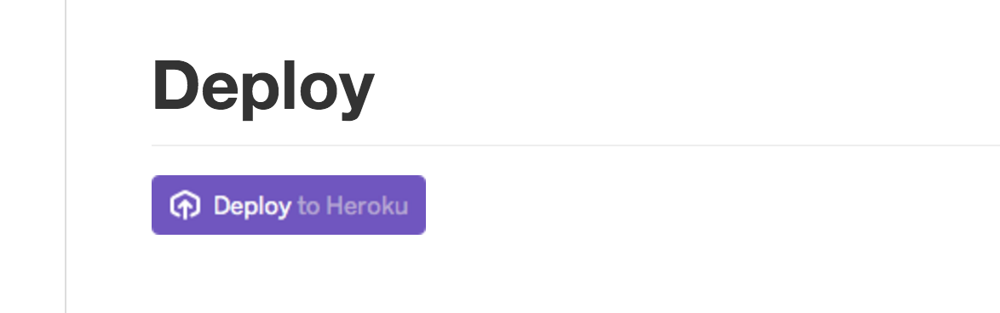

[[server]]
== RedPen Server

RedPen server provides almost all of RedPen's functionality via an
HTTP REST API.

[[starting-the-redpen-server]]
=== Starting and stopping RedPen Server

For details on how to start the RedPen Server, refer to <<commands,Commands>>.

[[heroku-button]]
=== Using the Heroku button to start RedPen Server
You can run RedPen Server in the Heroku environment by clicking the Heroku button at the bottom of the https://github.com/redpen-cc/redpen[RedPen README].

Click this button to start RedPen server in Heroku.

NOTE: You must register as a user in order to use Heroku.

The http://redpen.herokuapp.com/[sample RedPen Server] provided on the RedPen homepage runs in Heroku.

[[redpen-server-api]]
=== RedPen Server API

[[configuration]]
==== Configuration

*/rest/config/redpens* returns the settings that you can use with the preconfigured *redpens* method.

[suppress='WeakExpression']
===== GET Parameters

* Specify *_lang=xx_* to return only the configurations that match the specified language.
If you do not specify *_lang=xx_*, all configurations are returned.

The JSON response is as follows:

[source,json]
----
{
  "version": "1.1.2",
  "documentParsers": ["PLAIN", "MARKDOWN", "WIKI"],
  "redpens": {
     "en": {
      "lang": "en",
      "tokenizer": "cc.redpen.tokenizer.WhiteSpaceTokenizer",
      "validators": {
         "CommaNumber": { "languages": [], "properties": {} },
         "Contraction": { "languages": ["en"], "properties": {} },
         "DoubledWord": { "languages": [], "properties": {} },
         "EndOfSentence": { "languages": ["en"], "properties": {} },
         "InvalidExpression": { "languages": [], "properties": {} },
         "InvalidSymbol": { "languages": [], "properties": {} },
         "InvalidWord": { "languages": ["en"], "properties": {} },
         "ParagraphNumber": { "languages": [], "properties": {} },
         "SectionLength": { "languages": [], "properties": {"max_char_num": "2000"} },
         "SentenceLength": { "languages": [], "properties": {"max_len": "200"} },
         "SpaceBetweenAlphabeticalWord": { "languages": [], "properties": {} },
         "Spelling": { "languages": [], "properties": {} },
         "StartWithCapitalLetter": { "languages": ["en"], "properties": {} },
         "SuccessiveWord": { "languages": [], "properties": {} },
         "SymbolWithSpace": { "languages": [], "properties": {} },
         "WordNumber": { "languages": [], "properties": {} }
      }
    },
    "ja": {
      "lang": "ja",
      "tokenizer": "cc.redpen.tokenizer.JapaneseTokenizer",
      "validators": {
         "CommaNumber": { "languages": [], "properties": {} },
         "DoubledWord": { "languages": [], "properties": {} },
         "HankakuKana": { "languages": ["ja"], "properties": {} },
         "InvalidSymbol": { "languages": [], "properties": {} },
         "KatakanaEndHyphen": { "languages": ["ja"], "properties": {} },
         "KatakanaSpellCheck": { "languages": ["ja"], "properties": {} },
         "ParagraphNumber": { "languages": [], "properties": {} },
         "SectionLength": { "languages": [], "properties": {"max_num": "1500"} },
         "SentenceLength": { "languages": [], "properties": {"max_len": "100"} },
         "SpaceBetweenAlphabeticalWord": { "languages": [], "properties": {} },
         "SuccessiveWord": { "languages": [], "properties": {} }
      }
    }
  }
}
----

* The *_version_* property indicates the version of RedPen.
* The *_documentParsers_* array contains all supported document parsers.
* The *_redpens_* object shows the available pre-configured redpens and
how they are configured. Within each object:
** *_lang_* specifies the target language.
** *_tokenizer_* specifies the tokenizer class to use.
** *_validators_* shows which validators are configured.
This object is in a format suitable for the *_document/validate/json_* request below.
For each validator:
*** The *_languages_* array indicates the languages for which the validator is suitable.
An empty array denotes all languages.
*** The *_properties_* object denotes the property values specified for this validator.

[[document-validation]]
==== Validating documents

*/rest/document/validate*

This POST request validates a document and returns the errors.

[suppress=='CommaNumber']
===== POST parameters

* _document_ contains the text of the document to be validated.
* _documentParser_ specifies which parser should be used to parse the document.
The valid options are:::
  ** ASCIIDOC
  ** LATEX
  ** MARKDOWN
  ** PLAIN
  ** WIKI
* *_lang_* specifies the language used to tokenize the document.
Currently, values of *ja* (Japanese) and *en* (English/Whitespace) are supported.
* The optional *_format_* field specifies the output format of the validation result.
The valid options are:::
  ** json (default)
  ** json2
  ** plain
  ** plain2
  ** xml.
* The optional *_config_* field can be used to specify RedPen configuration elements,
as in a RedPen configuration file.

====== Examples using curl and document/validate

[source,bash]
----
$ curl --data document="Twas brillig and the slithy toves did gyre and gimble in the wabe" \
     --data lang=en --data format=PLAIN2 \
     --data config="`cat ./redpen-server/target/classes/conf/redpen-conf.xml`" \
     localhost:8080/rest/document/validate/
Line: 1, Offset: 0
    Sentence: Twas brillig and the slithy toves did gyre and gimble in the wabe
        Spelling: Found possibly misspelled word "brillig".
        Spelling: Found possibly misspelled word "slithy".
        Spelling: Found possibly misspelled word "toves".
        Spelling: Found possibly misspelled word "gyre".
        Spelling: Found possibly misspelled word "gimble".
        Spelling: Found possibly misspelled word "wabe".
        DoubledWord: Found repeated word "and".
----

[source,bash]
----
$ curl -s --data document="古池や,蛙飛び込む水の音" \
          --data config="`cat ./redpen-server/target/classes/conf/redpen-conf-ja.xml`" \
          localhost:8080/rest/document/validate/ | json_reformat
{
    "errors": [
        {
            "sentence": "古池や,蛙飛び込む水の音",
            "endPosition": {
                "offset": 4,
                "lineNum": 1
            },
            "validator": "InvalidSymbol",
            "lineNum": 1,
            "sentenceStartColumnNum": 0,
            "message": "Found invalid symbol \",\".",
            "startPosition": {
                "offset": 3,
                "lineNum": 1
            }
        }
    ]
}
----

*/rest/document/validate/json*

This POST request processes a validation request specified in JSON,
and returns any errors in a supported RedPen format.

[suppress='CommaNumber WeakExpression']
===== Request format

[source,json]
----
{
  "document": "Theyre is a blak rownd borl.",
  "format": "json2",
  "documentParser": "PLAIN",
  "config": {
    "lang": "en",
    "validators": {
      "CommaNumber": {},
      "Contraction": {},
      "DoubledWord": {},
      "EndOfSentence": {},
      "InvalidExpression": {},
      "InvalidSymbol": {},
      "InvalidWord": {},
      "ParagraphNumber": {},
      "SectionLength": {
        "properties": {
          "max_char_num": "2000"
        }
      },
      "SentenceLength": {
        "properties": {
          "max_len": "200"
        }
      },
      "SpaceBetweenAlphabeticalWord": {},
      "Spelling": {},
      "StartWithCapitalLetter": {},
      "SuccessiveWord": {},
      "SymbolWithSpace": {},
      "WordNumber": {}
    },
    "symbols": {
      "AMPERSAND": {
        "after_space": false,
        "before_space": true,
        "invalid_chars": "＆",
        "value": "&"
      },
      "ASTERISK": {
        "after_space": true,
        "before_space": true,
        "invalid_chars": "＊",
        "value": "*"
      }
    }
  }
}
----

* The *_document_* property specifies the text of the document to validate.
* The *_documentParser_* property specifies the name of a valid RedPen document parser.
The valid options are:::
  ** ASCIIDOC
  ** LATEX
  ** MARKDOWN
  ** PLAIN
  ** WIKI
* The *_format_* property specifies the output format of the validation result.
The valid options are:::
  ** json (default)
  ** json2
  ** plain
  ** plain2
  ** xml.
* The *_config_* object specifies the validator configuration for the request in JSON.
This consists of:
** A *_config_* object that contains a series of objects with the same name as a RedPen validator.
The validators specified here are used in the validation.
Each validator object can include a *_properties_* object,
which specifies the name and value of any properties used by the validator.
** A *_lang_* property that specifies the language of the document.
This specifies how the document will be tokenized by RedPen.
** A *_symbols_* object that contains details of default symbols to be overridden.
Each entry must be a valid symbol name, and can contain the following elements:
*** *_value_* specifies the symbol's value
*** *_invalid_chars_* specifies one or more invalid alternatives for this symbol
*** *_before_space_* and *_after_space_* specify if a space is required before or after the symbol.

Response (json2 format):

[source,json]
----
{
  "errors": [
    {
      "sentence": "Theyre is a blak rownd borl.",
      "position": {
        "start": {
          "offset": 0,
          "line": 1
        },
        "end": {
          "offset": 27,
          "line": 1
        }
      },
      "errors": [
        {
          "subsentence": {
            "offset": 0,
            "length": 6
          },
          "validator": "Spelling",
          "position": {
            "start": {
              "offset": 0,
              "line": 1
            },
            "end": {
              "offset": 6,
              "line": 1
            }
          },
          "message": "Found possibly misspelled word \"Theyre\"."
        },
        {
          "subsentence": {
            "offset": 12,
            "length": 4
          },
          "validator": "Spelling",
          "position": {
            "start": {
              "offset": 12,
              "line": 1
            },
            "end": {
              "offset": 16,
              "line": 1
            }
          },
          "message": "Found possibly misspelled word \"blak\"."
        },
        {
          "subsentence": {
            "offset": 17,
            "length": 5
          },
          "validator": "Spelling",
          "position": {
            "start": {
              "offset": 17,
              "line": 1
            },
            "end": {
              "offset": 22,
              "line": 1
            }
          },
          "message": "Found possibly misspelled word \"rownd\"."
        },
        {
          "subsentence": {
            "offset": 23,
            "length": 4
          },
          "validator": "Spelling",
          "position": {
            "start": {
              "offset": 23,
              "line": 1
            },
            "end": {
              "offset": 27,
              "line": 1
            }
          },
          "message": "Found possibly misspelled word \"borl\"."
        }
      ]
    }
  ]
}
----

[suppress='WeakExpression']
====== Some examples using curl and document/validate/json

[source,bash]
----
$ curl -s --data "document=fish and chips" http://localhost:8080/rest/document/validate | json_reformat
{
    "errors": [
        {
            "sentence": "fish and chips",
            "validator": "StartWithCapitalLetter",
            "lineNum": 1,
            "sentenceStartColumnNum": 0,
            "message": "Sentence starts with a lowercase character \"f\"."
        }
    ]
}
----

[source,bash]
----
$ curl -s --data "document=ここはどこでうか?&lang=ja&" http://localhost:8080/rest/document/validate | json_reformat
{
    "errors": [
        {
            "sentence": "ここはどこでうか?",
            "endPosition": {
                "offset": 9,
                "lineNum": 1
            },
            "validator": "InvalidSymbol",
            "lineNum": 1,
            "sentenceStartColumnNum": 0,
            "message": "Found invalid symbol \"?\".",
            "startPosition": {
                "offset": 8,
                "lineNum": 1
            }
        }
    ]
}
----

[source,bash]
----
$ curl -s --data "document=# Markdown Test%0A%0ASpellink Errah&lang=en&documentParser=MARKDOWN" http://localhost:8080/rest/document/validate | json_reformat
{
    "errors": [
        {
            "sentence": "Spellink Errah",
            "endPosition": {
                "offset": 8,
                "lineNum": 3
            },
            "validator": "Spelling",
            "lineNum": 3,
            "sentenceStartColumnNum": 0,
            "message": "Found possibly misspelled word \"Spellink\".",
            "startPosition": {
                "offset": 0,
                "lineNum": 3
            }
        },
        {
            "sentence": "Spellink Errah",
            "endPosition": {
                "offset": 14,
                "lineNum": 3
            },
            "validator": "Spelling",
            "lineNum": 3,
            "sentenceStartColumnNum": 0,
            "message": "Found possibly misspelled word \"Errah\".",
            "startPosition": {
                "offset": 9,
                "lineNum": 3
            }
        }
    ]
}
----

[source,bash]
----
curl -s -H "Content-Type: application/json" \
     --data '{document:"fisch and chipps",format:"plain",config:{validators:{Spelling:{},SentenceLength:{properties:{max_len:6}}}}}' \
     http://localhost:8080/rest/document/validate/json
1: ValidationError[Spelling], Found possibly misspelled word "fisch". at line: fisch and chipps
1: ValidationError[Spelling], Found possibly misspelled word "chipps". at line: fisch and chipps
1: ValidationError[SentenceLength], The length of the sentence (16) exceeds the maximum of 6. at line: fisch and chipps
----
