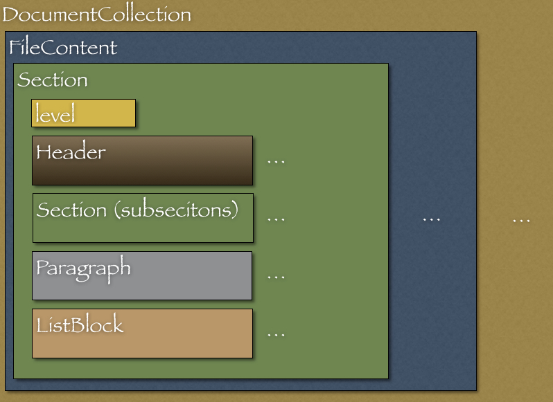

[[redpen-extension]]
== RedPen を拡張する

ユーザは自身で RedPen を拡張（機能追加）できます。
本節では機能追加の方法と RedPen が内部に保持する文書モデルについて解説します。
RedPen では Java と JavaScript を利用して機能を拡張できます。

=== Java による拡張の作成

Java で機能拡張を作成するには抽象クラス（Validator）を実装します。

[[extending-validators]]
==== Validator クラスの拡張

Validator クラスには実装できるメソッドがいくつか（validate ・ prevalidate ・ init）提供されています。
以下各メソッドについて解説します。

[[validate-methods]]
==== validate メソッド

機能を作成するには、**validate** メソッドの実装が必要です。
validate メソッドには引数によっていくつかのバリエーションがあります。
現状では三種類の validate メソッドが提供されています。

[source,java]
----
include::validate-java-interfaces.txt[]
----

NOTE: 実装されたクラスは特定のパッケージに属す必要があります。利用できるパッケージは **cc.redpen.validator** ・ **cc.redpen.validator.sentence** ・ **cc.redpen.validator.section** です。

[[prevalidate-method]]
==== prevalidate メソッド

preValidate は validate が呼び出される前に実行されます。preValidate メソッドを validate メソッドの前処理として利用すると便利です。
現在、二種類の prevalidate メソッドが提供されています。

[source,java]
----
include::prevalidate-java-interfaces.txt[]
----

[[conf-properties]]
==== 設定項目

validator の動作にあたって設定項目（プロパティ）を必要とする場合があります。その場合、validator のコンストラクタで必要なプロパティを定義します。
コンストラクタで定義すると、RedPen は各 validator についてプロパティが必要かを判断できます。

[source,java]
----
include::init-java-interfaces.txt[]
----

たとえば **SentencelengthValidator** は **max_len** というプロパティを提供します。
max_len は入力文書で許される一文の最大長を指定します。以下は文の最大長を二百に指定した設定例となります。

[source,xml]
----
include::load-property-config.xml[]
----

SentenceLengthValidator の作成時に max_len 値が設定ファイルから読み込まれます。
設定ファイルにおいて max_len が定義されていない場合は、デフォルト値が使用されます。

[source,java]
----
include::init-java-implementation.txt[]
----

一旦設定されたプロパティは、+++getInt("プロパティ名")+++ のように参照できます。

validate メソッドの実行前にプロパティを前処理しておきたいことがあります。その場合は init メソッドをオーバーライドしてください。

[[adding-validators]]
==== 作成した Validator の追加

RedPen に作成した Validator を追加する方法は二通りあります。

1つは、機能拡張（Validator）用ファイルを、RedPen のソースに追加してビルドする方法です。
この方法は簡単です。しかし機能拡張のソースファイルを RedPen ソースファイル群と同梱して扱う必要があります。

もう1つの方法はプラグインを作る方法です。プラグインの場合には、機能拡張ソースファイルを RedPen から独立して扱えます。

NOTE: どちらの方法でもファイル名に制約があります。ファイル名は語尾（サフィックス）、**Validator** で終わる必要があります。クラス名が Validator で終わらない場合、RedPen は実装された機能をロードできません。
以下、Validator を追加する方法とプラグインの作り方について解説します。

[[add-a-validator-in-redpen-source]]
==== Validator を RedPen のソースに追加

ではさっそく、簡単な Validator （PlainSentenceLengthValidator）を実装してみましょう。
PlainSentenceLengthValidator は文書内に存在する文が百文字もしくはそれ以上続く場合、エラーを出力します。
実装したのち、PlainSentenceLengthValidator を RedPen のソースに追加します。

[[sentencelengthvalidator]]
===== PlainSentenceLengthValidator

PlainSentenceLengthValidator クラスをパッケージ'cc.redpen.validator.sentence'に作成します。
このときクラスは 'redpen/redpen-core/src/main/java/cc/redpen/validator/sentence/' ディレクトリに保存します。

以下は PlainSentenceLengthValidator クラスの実装となります。

[source,java]
----
include::plainsentencelengthvalidator.java[]
----

PlainSentenceLengthValidator は validate （引数＝ Sentence オブジェクト）メソッドを実装しています。
PlainSentenceLengthValidator が設定ファイルに追加されると、RedPen は実装した validate メソッドを実行します。
Sentence が引数なので、RedPen は入力文書の文すべてを引数としてくりかえし実行します。

[[include-a-new-validator]]
===== 実装した Validator を適用する

では設定ファイルに作成した機能を追加しましょう。設定ファイルにはクラス名からサフィックス Validator をのぞいて追加します。
以下、PlainSentenceLengthValidator を設定に追加しています。

[source,xml]
----
include::extension-config.xml[]
----

[[create-a-validator-plugin]]
==== プラグインの作成

プラグイン作成で重要なファイルは pom.xml です。
pom.xml はビルドツール、Maven の設定ファイルです。以下は pom.xml の例です。

[source,java]
----
include::redpen-plugin-pom.xml[]
----

プラグインを作るには上の pom.xml ファイルが**ほぼ**そのまま利用できます。
変更する点は **artifactId** 、**name** 要素です。あなたの機能名になるよう名前を変更しましょう。

これで pom.xml が編集できました。編集した機能用のファイルを"main/java/cc/redpen/validator/sentence" （sentence）にコピーします。
上記で解説しましたように、機能用のクラスは Validator クラスを継承する必要があります。

Validator の実装ファイルをコピーすると、ビルドができます。以下のコマンドでプラグインを作成しましょう。

[source,bash]
----
$ mvn install
----

[[including-a-user-defined-validator-plugin]]
===== 作成したプラグインを利用する

無事 mvn コマンドによるビルドが成功しました。これで **target** ディレクトリにプラグイン用 jar ファイルが生成されます。
プラグイン用 jar ファイルを RedPen のクラスパスが含まれるディレクトリ（$REDPEN_HOME/lib など）にコピーします。
作成したプラグインが設定ファイルに追加されると、RedPen は実装した validate メソッドを実行します。

[[create-javascript-validator]]
=== JavaScript による拡張の作成
バージョン1.3から任意の JavaScript を Validator として実行する、**JavaScriptValidator** がサポートされました。JavaScript による Validator の作成にあたってはビルド作業が必要ありません。そのためユーザはより気軽に RedPen の Validator を作成できます。

[[enable-javascript]]
==== JavaScriptValidator を有効にする
JavaScriptValidator を使うのは簡単です。使うには `<validator name="JavaScript"/>` を設定ファイルへ追記します。以下は追記する例です。

[source, xml]
----
include::redpen-js-conf.xml[]
----

[[implement-javascript-validator]]
==== 機能の実装
JavaScriptValidator は `$REDPEN_HOME/js` ディレクトリから JavaScript ファイル（`.js`）を検索し、全て実行します。JavaScriptValidator が JavaScript ファイルを検索するディレクトリは `script-path` プロパティで指定できます。

文書の検査にあたり、JavaScriptValidator は 各 JavaScript ファイルに定義された関数を順次呼び出します。呼び出される関数は以下のシグニチャを持ちます。
[source,javascript]
----
include::js-validator-proto.js[]
----

[[javascript-validator-example]]
==== Validator の作成例
以下は、NumberOfCharacterValidator を JavaScript で作成した例です。

[source,javascript]
----
include::js-validator-example.js[]
----

上の例は Java 版と似ています。しかし型システムの違いによって Java 版における +++validate(Sentence sentence)+++ 関数が、JavaScript 版では +++validateSentence(sentence)+++ と呼ばれています。

[[javascript-run]]
==== 実行
`redpen` コマンドを実行すると JavaScript による Validator の実行ができます。以下は例で作成した JavaScript ファイルを Validator として実行する、コマンドラインの例です。上の例で作成した JavaScript ファイルを `$REDPEN_HOME/js` ディレクトリ以下に置いてください。

[source,bash]
----
$ ./bin/redpen -c myredpen-conf.xml 2be-validated.txt
2be-validated.txt:1: ValidationError[JavaScript], [NumberOfCharacter.js] Sentence is shorter than 100 characters long. at line: very short sentence.
----

[[javascript-property]]
==== JavaScriptValidator にパラメタ（プロパティ）を渡す

バージョン 1.7 より JavaScript で記述された機能にプロパティを渡せるようになりました。プロパティを渡すことで、機能の挙動を修正できます。プロパティ JavaScript 機能の設定ブロックに記述します。以下の例ではプロパティ **max_char_num** を 5 に設定しています。

----
<validator name="JavaScript">
  <property name="max_char_num" value="5" />
</validator>
----

JavaScript ブロックに登録されたプロパティは JavaScript 拡張から抽出できます。以下の JavaScript 機能拡張はプロパティ、 **max_char_num** の値を getInt メソッドで取り出しています。

----
function validateSentence(sentence) {
  var content = sentence.getContent().split(" ");
  var limit= getInt("max_char_num");

  for(var i = 0; i<content.length;i++){
    if(content[i].length >= limit){
      addError("word [" + content[i] +"] is too long. length: " + content[i].length, sentence);
    }
  }
}
----

プロパティを取り出すメソッドは型ごとに存在します。以下、サポートしている get メソッドの一覧です。

[options="header"]
|====
|メソッド名         |型
|``getInt``         |Int
|``getFloat``       |Float
|``getString``      |String
|``getBoolean``     |Boolean
|``getSet``         |Set
|====

[[model-structure]]
=== 文書モデル

本節では RedPen が内部に保持する文書モデルについて解説します。
RedPen は多様なテキストフォーマットをサポートします。
各種の入力文書は RedPen 内部で**文書モデル**というブロック（クラス）群に変換されます。

生成された内部文書モデルは以下のブロックからなります。

* *Document* 1つ以上の節を持つファイル
* *Section* 文書内の節に相当する。複数のブロック（見出し, パラグラフ, リスト）を保持する。
* *Header* 見出し文
* *Paragraph* パラグラフに相当（複数の文を保持する）
* *ListBlock* リスト要素（ListElement）を保持する

以下のイメージは RedPen が内部で使用する文書モデルです。

