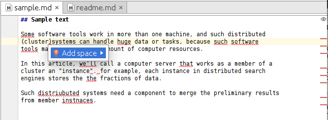

[[editor-support]]
[suppress='WeakExpression']
== Text Editor / IDE
Some software engineers develop RedPen packages for various editors such as Emacs or Atom.
This section introduces the RedPen packages.
With the following packages, we can enjoy the linting texts in the editors or IDEs.

[suppress='StartWithCapitalCharacter']
=== Atom

Atom is a modern text editor which works in various platforms such as OS X,
Linux, and Windows. https://atom.io/packages/linter-redpen[linter-redpen] is an sophisticated
Atom package created by https://atom.io/users/griffin-stewie[griffin-stewie]. This provides
real-time checking of texts.

=== Emacs

Emacs is a real-time display text editor. Many software engineers love this editor for the customisablity.
https://github.com/karronoli/redpen-paragraph.el[redpen-paragraph] is a Emacs package for RedPen created by
https://github.com/karronoli[karronoli].

=== Vim

https://github.com/rhysd/unite-redpen.vim[A unite.vim integration of redpen for automatic proofreading] is created by https://github.com/rhysd[rhysd]

=== IntelliJ IDEA

https://intellij-support.jetbrains.com[IntelliJ IDEA] is famous Java IDE (Integrated Development Environment)
 provided Jetbrains. But this IDE also provides many plugins to support editing markup texts such as AsiiDoc or Markdown.
We have been developing https://plugins.jetbrains.com/plugin/8210[IntelliJ IDEA plugin]. 

